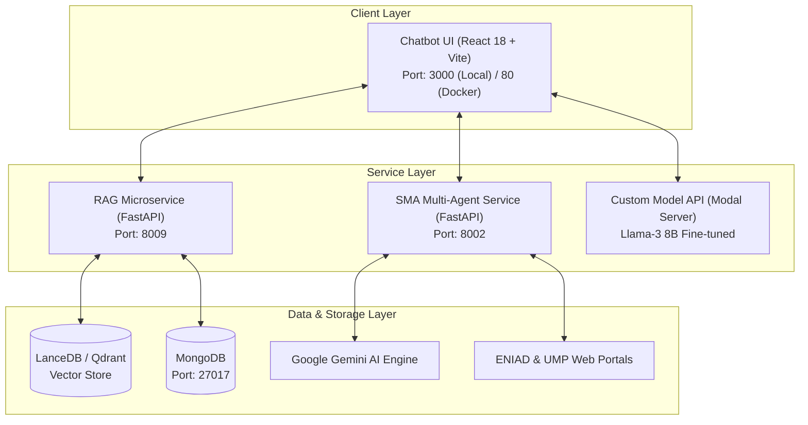
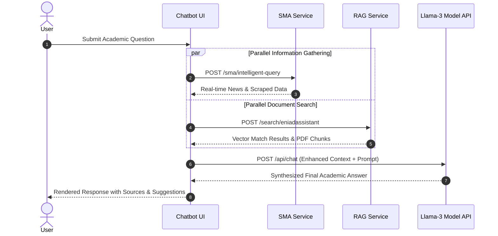

# 🏗️ ENIAD-ASSISTANT System Architecture & Developer Guide

Welcome to the **ENIAD-ASSISTANT** architectural guide. This document provides a comprehensive technical breakdown of the platform's microservices architecture, data pipelines, multi-agent workflows, and directory standards for current and future developers.

---

## 📐 1. System Topology Overview

**ENIAD-ASSISTANT** uses a decoupled, microservices-oriented architecture separating the conversational user interface from backend AI processing systems:



---

## 📂 2. Directory Structure & Component Guide

```text
ENIAD-ASSISTANT/
├── .github/                      # CI/CD Workflows, Issue & PR Templates, Governance
│   ├── workflows/ci-cd.yml       # GitHub Actions CI/CD Pipeline (ubuntu-latest)
│   ├── ISSUE_TEMPLATE/           # Standardized Issue Templates (Bug, Feature, Task)
│   └── CODE_OF_CONDUCT.md        # Contributor Covenant Code of Conduct
├── chatbot-ui/                   # Conversational Frontend Application
│   ├── src/
│   │   ├── components/           # Modular React UI Components (ChatInput, Sidebar, etc.)
│   │   ├── services/             # API Service Clients (ragApiService, realSmaService)
│   │   └── firebase.js           # Firebase Auth & Real-Time Sync Configuration
│   ├── Dockerfile                # Nginx multi-stage build container
│   ├── package.json              # React 18 + Vite dependencies
│   └── package-lock.json         # Exact dependency lockfile
├── RAG_Project/                  # RAG Vector Search Microservice (Port 8009)
│   ├── src/
│   │   ├── main.py               # FastAPI Server Entry Point
│   │   ├── routes/               # API Endpoint Routes (/search, /status)
│   │   ├── services/             # Document Ingestion & Vector Indexing Services
│   │   └── stores/               # Vector DB Providers (LanceDB & Qdrant)
│   ├── data/                     # Official ENIAD Academic PDF & Text Documents
│   └── Dockerfile                # RAG Service Container
├── SMA_Service/                  # Multi-Agent Intelligence Microservice (Port 8002)
│   ├── main.py                   # FastAPI Server Entry Point
│   ├── agents/                   # Autonomous Agents (WebScraper, ContentAnalyzer, RAGIntegrator)
│   ├── crew/                     # Agent Crew Orchestration Logic
│   ├── utils/                    # Gemini API Integration & DuckDuckGo Search Helpers
│   └── Dockerfile                # SMA Service Container
├── deploy_code/                  # Custom Fine-Tuned Llama-3 8B Deployment Scripts
│   ├── app.py                    # Modal Platform Inference Endpoint Definition
│   ├── main.py                   # Model Server Entry Point
│   ├── serve_llama.py            # Llama-3 8B vLLM Serving Configuration
│   └── test_llama3.py            # Model API Test Script
├── tests/                        # Automated Pytest Suite
│   ├── conftest.py               # Pytest Fixtures & Environment Mocks
│   ├── test_rag.py               # RAG Service Unit Tests
│   └── test_sma.py               # SMA Service Unit Tests
├── docker-compose.yml            # Multi-container Deployment Orchestrator
├── Dockerfile                    # Top-level Container Build Manifest
├── pytest.ini                    # Pytest Global Settings
├── README.md                     # Main Repository Documentation & Team Roster
├── LICENSE                       # MIT License
├── CHANGELOG.md                  # Release Version History
├── CONTRIBUTING.md               # Developer Contribution Rules
└── SECURITY.md                   # Vulnerability & Secret Protection Policy
```

---

## ⚡ 3. Microservice Network Contracts & Ports

| Component | Port | Internal URL | Purpose |
| :--- | :--- | :--- | :--- |
| **Chatbot UI** | **3000 / 80** | `http://localhost:3000` | Conversational Interface for Academic Users |
| `SMA_Service` | **8002** | `http://localhost:8002` | Real-time Web Scraping & Agent Analysis API |
| `RAG_Project` | **8009** | `http://localhost:8009` | Vector Search & Academic Document Ingestion API |
| `MongoDB` | **27017** | `mongodb://localhost:27017` | Persistent Chat Log & Metadata Storage |

---

## 🔄 4. Processing Flow & Query Execution



---

## 👥 5. The ENIAD AI Engineering Team

- **Abdellah ENNAJARI** – Lead AI & MLOps Engineer (*Microservice Architecture & CI/CD Pipeline*)
- **Ahmed OUKACHA** – AI Systems & Fine-Tuning Specialist (*Fine-tuned Llama-3 Model & Serving API*)
- **Oussama ELHADJI** – Full-Stack AI UI & SMA Multi-Agent Engineer (*React 18 UI & SMA Web Intelligence*)
- **Abdelilah OURTI** – Vector DB & RAG Pipeline Engineer (*LanceDB / Qdrant Vector Store & Embeddings*)
