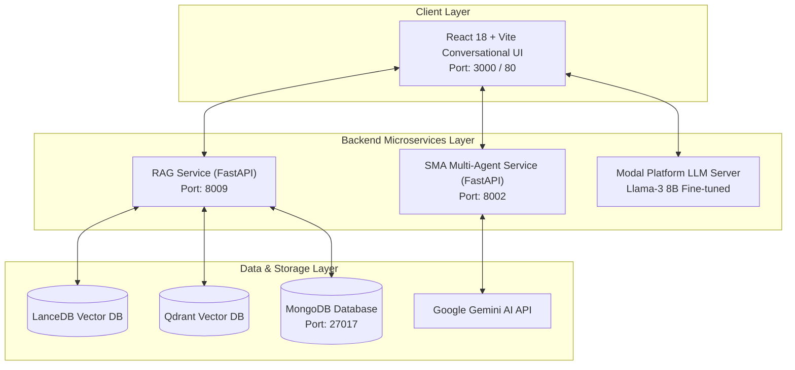
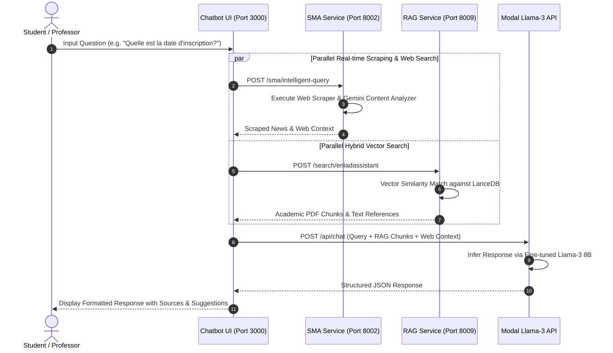

# 🏗️ System Architecture & Data Flow

This section details the architectural design, microservice interaction patterns, sequence diagrams, and port contracts for **ENIAD-ASSISTANT**.

---

## 1. Microservices System Topology

---

## 2. Service Port Matrix & API Contracts

| Service Name | Primary Language | Framework | Port | Primary Endpoints |
| :--- | :--- | :--- | :--- | :--- |
| **Chatbot UI** | JavaScript (ES6+) | React 18 / Vite | `3000` | N/A (Frontend Web Interface) |
| **SMA Microservice** | Python 3.12 | FastAPI | `8002` | `POST /sma/intelligent-query`, `GET /health`, `GET /sma/monitor` |
| **RAG Microservice** | Python 3.12 | FastAPI | `8009` | `POST /search/{project_id}`, `GET /status`, `POST /api/v1/data/process` |
| **MongoDB** | C++ | Database | `27017` | `mongodb://localhost:27017` |

---

## 3. End-to-End Query Sequence Diagram

---

## 4. Module Decoupling Strategy

- **Stateless Microservices**: The RAG and SMA microservices run as independent, stateless FastAPI containers.
- **Fail-safe Fallback Routing**: In [coordinationService.js](../../chatbot-ui/src/services/coordinationService.js), if the SMA backend is unavailable, queries seamlessly fallback to local RAG or custom model inference.
