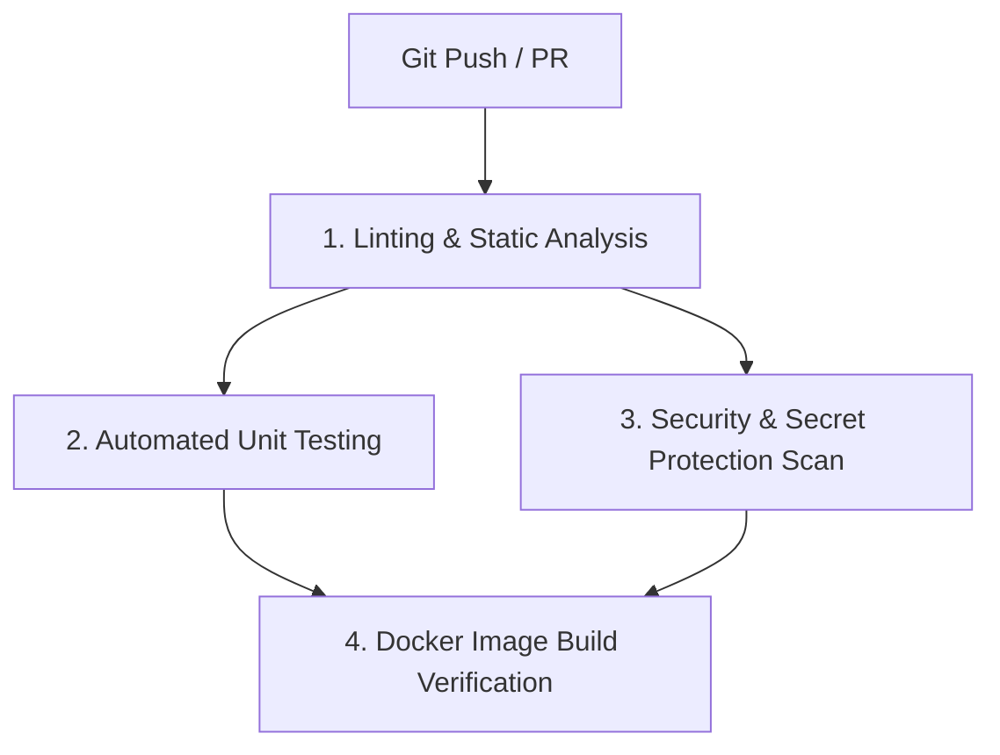

# ⚙️ DevOps & CI/CD Engineering Guide

This document details the CI/CD automation, Docker containerization, secret isolation policies, and runner strategies maintained by **Abdellah ENNAJARI**.

---

## 1. GitHub Actions CI/CD Pipeline (`.github/workflows/ci-cd.yml`)

The CI/CD pipeline triggers automatically on every `push` to `main`, `dev-*`, and `master` branches, as well as on Pull Requests against `main`.



### Pipeline Jobs Breakdown:

1. **`lint-and-format`**:
   - Compiles Python files (`SMA_Service/main.py`, `RAG_Project/src/main.py`).
   - Runs `npm install` and `npm run build` in `chatbot-ui/`.
2. **`unit-tests`**:
   - Executes the Pytest suite (`pytest tests/ -v`).
3. **`security-scan`**:
   - Verifies that secret `.env` files are excluded from Git tracking.
4. **`docker-build-verification`**:
   - Validates `docker-compose.yml` configuration syntax (`docker compose config`).

---

## 2. Multi-Container Docker Compose (`docker-compose.yml`)

```yaml
version: '3.8'

services:
  frontend:
    build:
      context: ./chatbot-ui
      dockerfile: Dockerfile
    ports:
      - "3000:80"
    environment:
      - VITE_RAG_SYSTEM_BASE_URL=http://rag-service:8009
      - VITE_SMA_API_URL=http://sma-service:8002

  rag-service:
    build:
      context: ./RAG_Project
      dockerfile: Dockerfile
    ports:
      - "8009:8009"

  sma-service:
    build:
      context: ./SMA_Service
      dockerfile: Dockerfile
    ports:
      - "8002:8002"

  mongodb:
    image: mongo:latest
    ports:
      - "27017:27017"
```

### Launching Environment:

```bash
docker compose up -d --build
```
