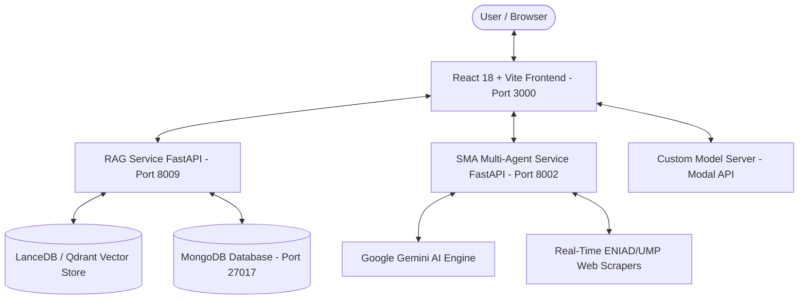

# 📚 ENIAD-ASSISTANT: Official Technical Wiki & System Documentation

Welcome to the official technical wiki for **ENIAD-ASSISTANT**, the enterprise conversational AI platform developed for **École Nationale d'Intelligence Artificielle et du Digital (ENIAD)** at Université Mohammed Premier (UMP), Oujda, Morocco.

---

## 🧭 Wiki Navigation Hub

| Section | Content & Focus Area | Link |
| :--- | :--- | :--- |
| **🏠 Home & Overview** | Platform mission, architecture overview, AI Engineering team roster | [Home](home.md) |
| **🏗️ System Architecture** | Topology, microservices interaction, sequence diagrams, port map | [System Architecture](architecture.md) |
| **💻 Frontend Application** | React 18 + Vite components, state management, API services, UI themes | [Frontend Guide](frontend-ui.md) |
| **🧮 RAG Microservice** | Vector DB (LanceDB/Qdrant), document processing, FastAPI endpoints (8009) | [RAG Service](rag-service.md) |
| **🤖 SMA Multi-Agent System** | Autonomous web scrapers, Gemini AI analysis, crew orchestration (8002) | [SMA Service](sma-service.md) |
| **🧠 Model Deployment** | Fine-tuned Llama-3 8B model (`ahmed-ouka`), Modal platform vLLM serving | [Model Deployment](model-deployment.md) |
| **⚙️ DevOps & CI/CD** | GitHub Actions pipeline, multi-stage Docker Compose, environment secrets | [DevOps & CI/CD](devops-cicd.md) |
| **🧪 Testing & Quality** | Pytest test suite, ESLint & SonarLint code quality, security controls | [Testing & Quality](testing-quality.md) |
| **❓ Troubleshooting & FAQ** | Port conflict resolution, startup diagnostics, error fixes | [FAQ & Troubleshooting](faq.md) |

---

## 👥 The ENIAD AI Engineering Team

This system was engineered as part of the **Projet de Fin d'Année (PFA)** by a team of **4 AI Engineers** from **ENIAD - Université Mohammed Premier (UMP)**:

| AI Engineer | Official Role | Core Technical Responsibilities |
| :--- | :--- | :--- |
| **Abdellah ENNAJARI** | **Lead AI & MLOps Engineer** | Microservice System Architecture, CI/CD Pipeline Automation, Multi-stage Docker Containerization, System Integration & Service Port Harmonization |
| **Ahmed OUKACHA** | **AI Systems & Fine-Tuning Specialist** | Custom Fine-Tuned Llama-3 8B Academic Model (`ahmed-ouka/llama3-8b-eniad-merged-32bit`), Model Server & Modal Platform API Integration |
| **Oussama ELHADJI** | **Full-Stack AI UI & SMA Multi-Agent Engineer** | React 18 + Vite Conversational Frontend UI, Real-Time Agent Streaming, SMA Multi-Agent Web Intelligence Service & Web Scrapers |
| **Abdelilah OURTI** | **Vector DB & RAG Pipeline Engineer** | LanceDB / Qdrant Vector Store Indexing, Academic Document Embedding Pipelines, RAG Query Optimizations & Fast Search Backend |

---

## 🏛️ High-Level System Architecture Overview

---

## 🌐 Network Ports & Microservices Summary

| Service | Technology Stack | Network Port | Service Purpose |
| :--- | :--- | :--- | :--- |
| `eniad-assistant-ui` | React 18 + Vite + Nginx | **3000** (Local) / **80** (Docker) | Conversational Web Interface |
| `SMA_Service` | FastAPI + Gemini AI + Scrapers | **8002** | Multi-Agent Web Intelligence API |
| `RAG_Project` | FastAPI + LanceDB / Qdrant | **8009** | Vector Search & Document Ingestion API |
| `MongoDB` | MongoDB | **27017** | Chat History & Session Storage |
