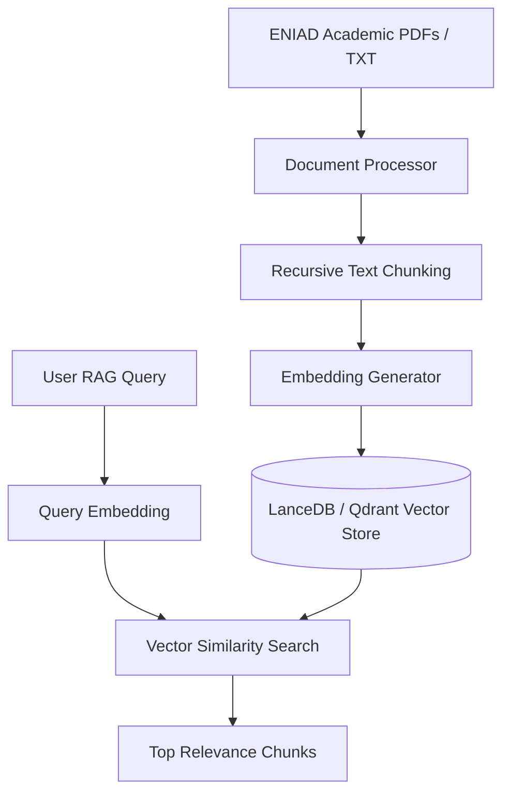

# 🧮 RAG Microservice Guide (`RAG_Project`)

The `RAG_Project` microservice is built with **FastAPI**, **LanceDB**, **Qdrant**, and **PyPDF2**. It handles vector embedding storage, document chunking, and semantic vector similarity search against ENIAD academic documents.

---

## 1. Directory Structure (`RAG_Project/`)

```text
RAG_Project/
├── Dockerfile                    # Container build configuration
├── requirements.txt              # FastAPI & Vector DB dependencies
├── data/                         # ENIAD Official Academic Documents
│   ├── CNPN_Cycle-ingenieur_2024.pdf
│   ├── CNPN_Cycle_Ingenieur.pdf
│   ├── ENIAD_COMPLET_FR.txt
│   ├── ENIAD_COMPLET_AR.txt
│   └── règlement_intérieur_eniad.pdf
└── src/
    ├── main.py                   # FastAPI Application Entry Point (Port 8009)
    ├── routes/                   # API Endpoints
    │   ├── data.py               # Document Ingestion & Upload Routes
    │   ├── nlp.py                # Vector Search & Semantic RAG Routes
    │   └── base.py               # System Health & Status Routes
    ├── services/
    │   └── document_processor.py # PDF Text Extraction & Chunking Service
    └── stores/
        ├── vectordb/             # LanceDB & Qdrant Vector DB Providers
        └── llm/                  # Embeddings & LLM Provider Factory
```

---

## 2. RAG Pipeline Workflow



---

## 3. Key REST API Endpoints

### Health Check
- **Endpoint**: `GET /status`
- **Response**:
  ```json
  {
    "status": "operational",
    "projects": ["eniadassistant"],
    "total_files": 6,
    "total_chunks": 1420
  }
  ```

### Vector Search
- **Endpoint**: `POST /search/{project_id}`
- **Payload**:
  ```json
  {
    "query": "Quelles sont les conditions de réinscription?",
    "language": "fr",
    "limit": 5,
    "mode": "hybrid"
  }
  ```
- **Response Signal**: `vectordb_search_success` with relevant document chunks.

---

## 4. Environment Variables (`RAG_Project/.env`)

```ini
RAG_PORT=8009
RAG_PROJECT_ID=eniadassistant
VECTOR_DB_PROVIDER=lancedb
EMBEDDINGS_PROVIDER=local
```
