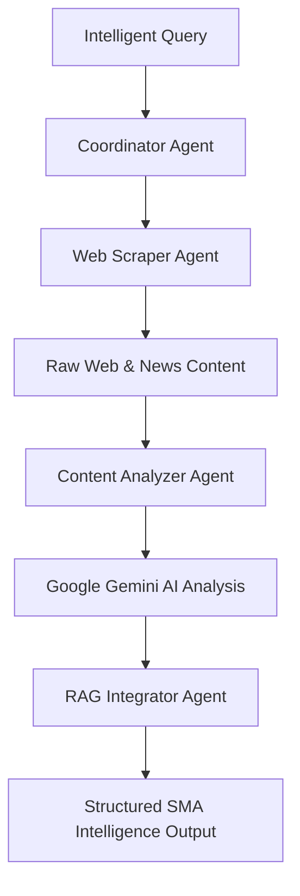

# 🤖 SMA Multi-Agent Microservice Guide (`SMA_Service`)

The `SMA_Service` microservice is an autonomous **Système Multi-Agents (SMA)** built with **FastAPI**, **CrewAI**, **Google Gemini AI**, and **BeautifulSoup4**. It provides real-time web scraping, news search, text summarization, and multi-lingual translation.

---

## 1. Directory Structure (`SMA_Service/`)

```text
SMA_Service/
├── main.py                       # FastAPI Application Entry Point (Port 8002)
├── Dockerfile                    # Container build configuration
├── requirements.txt              # FastAPI, CrewAI, Gemini & Scraper dependencies
├── agents/                       # Autonomous Multi-Agent Implementations
│   ├── web_scraper_agent.py      # Real-time Web Scraping Agent for ENIAD/UMP
│   ├── content_analyzer_agent.py # Text Summarization & Scoring via Gemini
│   ├── rag_agent.py              # Context Integration Agent
│   ├── coordinator_agent.py      # Workflow Orchestrator Agent
│   ├── pdf_reader_agent.py       # PDF Content Reader Agent
│   └── image_ocr_agent.py        # Image OCR & Multimodal Agent
├── crew/
│   └── sma_crew.py               # CrewAI Multi-Agent Task Orchestration
└── utils/
    ├── comprehensive_search.py   # Multi-source Web Search Engine
    ├── duckduckgo_news.py        # DuckDuckGo News Search API
    └── gemini_service.py         # Google Gemini AI Integration
```

---

## 2. Multi-Agent Workflow Execution



---

## 3. Key REST API Endpoints

### Health Check
- **Endpoint**: `GET /health`
- **Response**: `{"status": "healthy", "service": "SMA_Service"}`

### Intelligent Query Processing
- **Endpoint**: `POST /sma/intelligent-query`
- **Payload**:
  ```json
  {
    "query": "Dernières actualités de l'ENIAD",
    "language": "fr",
    "search_depth": "medium",
    "include_news": true,
    "include_images": true
  }
  ```
- **Response**: Formatted JSON response containing summarized web findings, article sources, confidence score, and metadata.

---

## 4. Environment Variables (`SMA_Service/.env`)

```ini
SMA_PORT=8002
GEMINI_API_KEY=your_gemini_api_key
MAX_WORKERS=4
```
