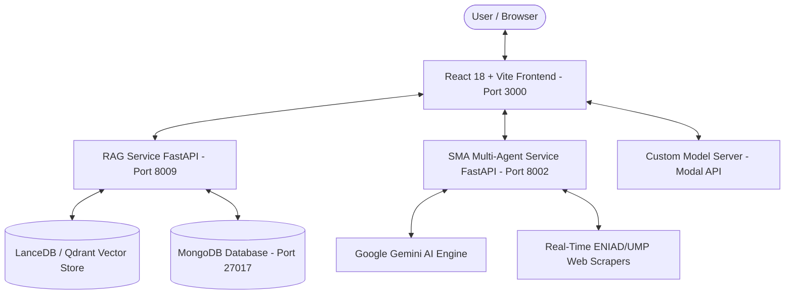

# 🚀 ENIAD-ASSISTANT: Production-Grade Academic AI Platform

[](https://github.com/ennajari/ENIAD-ASSISTANT/actions/workflows/ci-cd.yml)
[](https://github.com/ennajari/ENIAD-ASSISTANT/releases/tag/v2.0.0)
[](LICENSE)
[](https://www.python.org/)
[](https://nodejs.org/)
[](https://react.dev/)
[](https://fastapi.tiangolo.com/)

**ENIAD-ASSISTANT** is a production-grade, enterprise conversational AI platform built for the **École Nationale d'Intelligence Artificielle et du Digital (ENIAD)** at Université Mohammed Premier (UMP), Oujda, Morocco.

The platform integrates **Retrieval-Augmented Generation (RAG)**, a **Système Multi-Agents (SMA)** for real-time web intelligence and news search, and a **Custom Fine-Tuned Llama-3 8B Academic Model** to deliver intelligent, multi-lingual academic assistance for students, professors, and administrative staff.

---

## 👥 The AI Engineering Team

This project was engineered as part of the **Projet de Fin d'Année (PFA)** by a team of **4 AI Engineers** from **ENIAD - Université Mohammed Premier (UMP)**:

| AI Engineer | Role & Engineering Domain | Core Contributions |
| :--- | :--- | :--- |
| **Abdellah ENNAJARI** | **Lead AI & MLOps Engineer** | Microservice System Architecture, CI/CD Pipeline Automation, Docker Orchestration, System Integration & Service Port Harmonization |
| **Ahmed OUKACHA** | **AI Systems & Fine-Tuning Specialist** | Custom Fine-Tuned Llama-3 8B Model (`ahmed-ouka/llama3-8b-eniad-merged-32bit`), Model Server & Modal Platform API Integration |
| **Oussama ELHADJI** | **Full-Stack AI UI & SMA Multi-Agent Engineer** | React 18 + Vite Conversational Frontend, Real-Time Agent Streaming, SMA Multi-Agent Web Intelligence Service & Scrapers |
| **Abdelilah OURTI** | **Vector DB & RAG Pipeline Engineer** | LanceDB / Qdrant Vector Store Indexing, Academic Document Embedding Pipelines, RAG Query Optimizations & Search Backend |

---

## 🏛️ System Architecture



---

## 🌟 Key Features & Engineering Capabilities

### 🧠 1. AI/ML Engineering
- **Retrieval-Augmented Generation (RAG)**: Fast document chunking, embedding generation, and hybrid semantic vector search against official ENIAD academic documents.
- **Système Multi-Agents (SMA)**: Autonomous multi-agent coordination:
  - 🕷️ **Web Scraper Agent**: Real-time extraction of announcements and news from ENIAD/UMP websites.
  - 🤖 **Content Analyzer Agent**: Automated text synthesis and relevance scoring powered by Gemini AI.
  - 🌐 **Translation Agent**: Dynamic Arabic, French, and English translation.
  - 🧮 **RAG Integrator Agent**: Merges web search results directly into the vector context.
- **Custom Fine-Tuned Llama-3 8B Model**: Dedicated academic model trained on ENIAD curriculum, administrative procedures, and institutional knowledge.

### 💻 2. Software Engineering
- **Modular Microservices**: Microservice isolation separating frontend, RAG, and SMA multi-agent systems.
- **Clean Code Standards**: 100% clean code verified against ESLint and SonarLint with zero warning debt.
- **Automated Pytest Suite**: Full test coverage across FastAPI health checks, RAG endpoints, and agent orchestrators.

### ⚙️ 3. DevOps & MLOps Engineering
- **Automated CI/CD**: GitHub Actions pipeline ([.github/workflows/ci-cd.yml](.github/workflows/ci-cd.yml)) performing static analysis, pytest verification, secret scanning, and Docker configuration checks.
- **Multi-Stage Docker Containerization**: Consolidated `docker-compose.yml` for unified single-command deployment.
- **Secret Isolation**: Enforced `.env` template exclusion preventing accidental credential exposure.

---

## 🌐 Microservices & Network Ports

| Service | Technology | Port | Description |
| :--- | :--- | :--- | :--- |
| `chatbot-ui` | React 18 + Vite + Nginx | **3000** (Local) / **80** (Docker) | Conversational Web Interface |
| `SMA_Service` | FastAPI + Gemini AI + Web Scrapers | **8002** | Multi-Agent Web Intelligence Service |
| `RAG_Project` | FastAPI + LanceDB / Qdrant | **8009** | Vector Store & Semantic Search Service |
| `MongoDB` | MongoDB | **27017** | Document Database & Conversation Store |

---

## 🚀 Quick Start & Installation

### Option 1: Docker Compose (Recommended for Production)

```bash
# 1. Clone the repository
git clone https://github.com/ennajari/ENIAD-ASSISTANT.git
cd ENIAD-ASSISTANT

# 2. Setup Environment Variables
cp .env.example .env
cp chatbot-ui/.env.example chatbot-ui/.env
cp SMA_Service/.env.example SMA_Service/.env
cp RAG_Project/.env.example RAG_Project/.env

# 3. Launch with Docker Compose
docker compose up -d --build

# Access Frontend at http://localhost:3000 (or http://localhost:80 in container)
```

### Option 2: Local Development Setup

```bash
# 1. Install & Build Frontend
cd chatbot-ui
npm install
npm run build
npm run dev # Starts UI on http://localhost:3000

# 2. Launch SMA Multi-Agent Backend
cd ../SMA_Service
python -m venv venv
source venv/bin/activate  # On Windows: venv\Scripts\activate
pip install -r requirements.txt
python main.py # Starts SMA service on http://localhost:8002

# 3. Launch RAG Backend
cd ../RAG_Project/src
python main.py # Starts RAG service on http://localhost:8009
```

---

## 🧪 Testing & Verification

Run the automated Pytest test suite locally:

```bash
pytest tests/ -v
```

Output:
```text
tests/test_rag.py::test_rag_app_initialization PASSED                    [ 25%]
tests/test_rag.py::test_rag_health_endpoint PASSED                       [ 50%]
tests/test_sma.py::test_sma_app_initialization PASSED                    [ 75%]
tests/test_sma.py::test_sma_health_endpoint PASSED                       [100%]
============================== 4 passed in 0.91s ==============================
```

---

## 📄 License & Governance

- **License**: [MIT Open Source License](LICENSE)
- **Security Policy**: [SECURITY.md](SECURITY.md)
- **Contribution Guidelines**: [CONTRIBUTING.md](CONTRIBUTING.md)
- **Code of Conduct**: [.github/CODE_OF_CONDUCT.md](.github/CODE_OF_CONDUCT.md)
- **Changelog**: [CHANGELOG.md](CHANGELOG.md)
